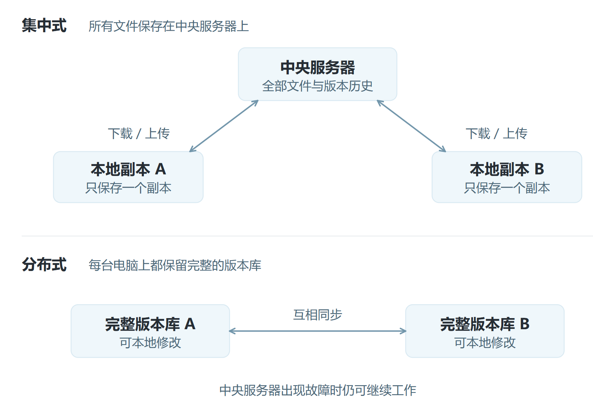

# Git 基础

## 版本控制系统

### 版本控制与 Git 要解决的问题

Git 是一个免费、开源的分布式版本控制系统。它用仓库记录文件的变化，为每个文件保存完整的版本历史。你可以查看谁在什么时间修改了哪些内容，也可以在需要时把文件恢复到之前的版本。

### 集中式与分布式两种工作方式

常见的集中式版本控制系统有 SVN；Git 则是分布式版本控制系统。



## Git 命令

### 命令统一以 `git` 开头

为了与 Linux 命令区分，Git 的命令都以 `git` 开头，后面跟具体的子命令。例如，`git init` 用于初始化仓库。

### 使用 `git config` 配置用户名和邮箱

```bash
git config --global user.name "你的 GitHub 用户名"
git config --global user.email "your_email@example.com"

# 验证配置
git config --global --list
```

| 参数 | 生效范围 |
| --- | --- |
| 不加参数 | 只对当前 Git 仓库有效 |
| `--global` | 全局配置，对当前用户的所有 Git 仓库有效，使用最多 |
| `--system` | 系统级配置，对所有用户有效，一般不会用到 |

### 新建 Git 仓库：`git init` 与 `git clone`

版本库也叫仓库。创建仓库，就是把一个普通目录变成 Git 能管理的目录。通常有两种方式：

- **本地创建**：在自己的电脑上直接创建仓库。
- **远程克隆**：从远程服务器克隆一个已经存在的仓库。

#### `git init`：在本地把目录变成仓库

在目标目录中运行 `git init` 后，Git 会创建隐藏的 `.git` 目录，用来保存仓库配置、版本历史等信息。不要随意修改这个目录。也可以在命令后加目录名，让 Git 创建并初始化指定目录。

```bash
git init
git init <目录名>
```

#### `git clone`：从远程服务器获取已有仓库

```bash
git clone <仓库地址> [自定义目录名]
```

Git 仓库地址通常以 `.git` 结尾。

## Git 的三个工作区域与文件状态

Git 把本地数据分成三个区域：

- **工作区**：实际编辑文件的目录。
- **暂存区**：准备提交的临时区域。
- **本地仓库**：保存提交记录、代码版本与历史信息的位置。

文件在修改、暂存和提交的过程中，会在这些区域之间流动。


## `git reset`：回退版本

| 参数 | 暂存区 | 工作区 |
| --- | --- | --- |
| `--soft` | 保留所有修改 | 保留所有修改 |
| `--mixed`（默认） | 丢弃修改 | 保留修改 |
| `--hard` | 丢弃修改 | 丢弃修改 |

> `git reset --hard` 会直接丢弃工作区修改，使用前一定要确认没有需要保留的内容。

## `git diff`：查看差异

| 命令 | 比较的两个位置 |
| --- | --- |
| `git diff` | 工作区 ↔ 暂存区 |
| `git diff HEAD` | 工作区 ↔ 本地仓库 |
| `git diff --cached` | 暂存区 ↔ 本地仓库 |

## Git 命令速查

### 1. 配置与初始化

| 命令 | 说明 |
| --- | --- |
| `git config --global user.name "名字"` | 配置全局用户名（必须） |
| `git config --global user.email "邮箱"` | 配置全局邮箱（必须） |
| `git config --list` | 查看当前配置 |
| `git init` | 在当前目录初始化 Git 仓库 |
| `git clone <仓库地址>` | 克隆远程仓库到本地 |

### 2. 基本工作流

| 命令 | 说明 |
| --- | --- |
| `git status` | 查看当前文件状态；通常红色表示未暂存，绿色表示已暂存 |
| `git add <文件名>` | 将指定文件添加到暂存区 |
| `git add .` | 将当前目录下的全部修改添加到暂存区 |
| `git commit -m "提交说明"` | 将暂存区内容提交到本地仓库 |
| `git commit -am "提交说明"` | 跳过 `git add`，直接提交已跟踪文件的修改 |

### 3. 分支管理

| 命令 | 说明 |
| --- | --- |
| `git branch` | 查看本地分支 |
| `git branch -a` | 查看本地和远程的全部分支 |
| `git branch <分支名>` | 创建新分支 |
| `git checkout <分支名>` | 切换到指定分支 |
| `git switch <分支名>` | 切换分支（新版 Git 推荐） |
| `git checkout -b <分支名>` | 创建并立即切换到新分支 |
| `git merge <分支名>` | 将指定分支合并到当前分支 |

### 4. 远程仓库操作

| 命令 | 说明 |
| --- | --- |
| `git remote -v` | 查看关联的远程仓库地址 |
| `git remote add origin <地址>` | 关联远程仓库，通常命名为 `origin` |
| `git pull` | 拉取远程最新代码并合并到本地 |
| `git fetch` | 拉取远程最新代码，但不自动合并 |
| `git push` | 将本地提交推送到远程仓库 |
| `git push -u origin main` | 首次推送本地 `main` 分支并建立追踪关系 |
| `git push origin --delete <分支名>` | 删除远程分支 |

### 5. 查看历史与差异

| 命令 | 说明 |
| --- | --- |
| `git log` | 查看详细提交历史，按 `q` 退出 |
| `git log --oneline` | 每条提交用一行显示 |
| `git log --graph --oneline` | 以图形方式查看分支合并历史 |
| `git diff` | 查看工作区与暂存区的差异 |
| `git diff --staged` | 查看暂存区与最后一次提交的差异 |

### 6. 撤销与回退

| 命令 | 说明 |
| --- | --- |
| `git restore <文件名>` | 撤销尚未暂存的工作区修改 |
| `git restore --staged <文件名>` | 将文件从暂存区撤回工作区 |
| `git reset --soft HEAD~1` | 撤销最近一次提交，修改仍保留在暂存区 |
| `git reset --hard HEAD~1` | **危险**：撤销最近一次提交并丢弃所有修改 |
| `git checkout -- <文件名>` | 旧版撤销命令，作用近似 `git restore` |

### 7. 服务器部署时的常用组合

| 场景 | 命令 |
| --- | --- |
| 首次下载项目 | `git clone <地址>` |
| 更新到最新版 | `cd 项目目录`，再运行 `git pull` |
| 查看修改了哪些文件 | `git status` |
| 临时保存本地修改 | `git stash`；拉取代码后用 `git stash pop` 恢复 |
| 查看当前版本 | `git log -1 --oneline` |
