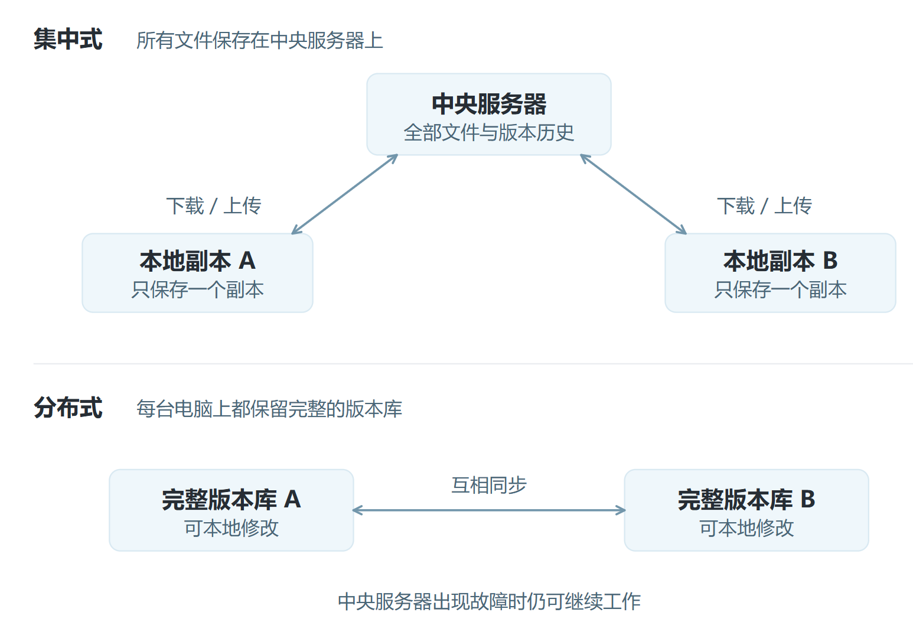
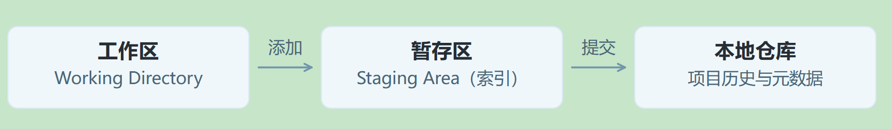

# Git 基础

## 一、版本控制系统

### 1.1 版本控制与 Git 要解决的问题

Git 是一个免费开源的分布式版本控制系统，用一个叫做仓库的数据库记录文件的变化。仓库中的每个文件都有完整的版本历史，可以看到谁在什么时间修改了哪些文件的哪些内容；需要时，可以把文件恢复到之前的某一个版本。

### 1.2 集中式与分布式两种工作方式

集中式版本控制系统比如 SVN 等；分布式版本控制系统，如 Git。



*图 1｜集中式与分布式版本控制对比*

## 二、git 命令

### 2.1 命令统一以 git 开头

为了区分 Linux 操作系统中的命令，Git 的所有命令都以 **git** 开头，后面跟着具体的子命令。例如 **git init** 就是初始化一个仓库。

### 2.2 git config 配置用户名和邮箱

```bash
git config --global user.name "你的GitHub用户名"
git config --global user.email "your_email@example.com"
```

验证配置：

```bash
git config --global --list
```

下表回答的是：git config 的三个参数各自在多大的范围生效。

| **参数** | **生效范围** |
| --- | --- |
| **不加参数** | 只对当前的 Git 仓库有效。 |
| **--global** | 全局配置，对所有 Git 仓库都有效，使用最多。 |
| **--system** | 系统级别的配置，对所有用户都有效，一般不会用到。 |

### 2.3 新建 Git 仓库：git init 与 git clone

版本库又叫仓库，创建仓库就是把一个普通目录变成 Git 能管理的目录。这一节按视频的推进顺序整理三件事：仓库的含义与两种创建途径；本地用 git init 初始化仓库的完整过程，包括从命令行提示符和 .git 目录确认仓库已经生效、为什么不能随意改动这个隐藏目录、以及 git init 后面加上目录名时仓库位置的变化；最后是从远程服务器克隆一个已有仓库的演示。
创建一个仓库非常简单，只需要把一个目录变成 Git 可以管理的仓库就可以了。一般来说有两种创建方式。

- **本地创建** — 在自己电脑本地直接创建一个仓库。
- **远程克隆** — 从远程服务器上克隆一个已经存在的仓库。

#### 2.3.1 git init：在本地把目录变成仓库

```bash
git init
```

执行后在当前目录生成一个 `.git` 隐藏目录，它就是 Git 仓库的约定后缀，本地仓库的所有版本历史都存放在这里。

**注意**：不要随意改动 `.git` 目录里的内容，否则可能损坏仓库。
如果在 `git init` 后面加上目录名（如 `git init myrepo`），Git 会在当前目录下新建 `myrepo` 目录，并把仓库创建在那里，而不是当前目录。

#### 2.3.2 git clone：从远程服务器拿一个已有仓库

```bash
git clone <仓库地址> [自定义目录名]
```

不加自定义目录名时，Git 会用仓库名作为本地目录名。

## 三、Git 的三个工作区域与文件状态

Git 把本地数据分成工作区、暂存区和本地仓库三个区域，文件在修改、添加和提交的过程中又处在不同状态。
简单来说，工作区是实际操作文件的目录，暂存区是中间的临时区域，本地仓库是存储代码和版本信息的主要位置。



*图 2｜Git 三个工作区域与文件状态的流转*

## 四、git reset 回退版本

下表回答的是：三种 reset 参数分别会动到暂存区还是工作区。

| **参数** | **暂存区** | **工作区** |
| --- | --- | --- |
| **--soft** | 保留所有修改 | 保留所有修改 |
| **--mixed（默认）** | 丢弃修改 | 保留修改 |
| **--hard** | 丢弃修改 | 丢弃修改 |

## 五、git diff：在三个区域与任意两个版本之间查看差异

下表回答的是：git diff 加上不同参数时，比较的是哪两个位置。

| **命令** | **比较的两个位置** |
| --- | --- |
| **git diff** | 工作区 ↔ 暂存区 |
| **git diff HEAD** | 工作区 ↔ 版本库 |
| **git diff --cached** | 暂存区 ↔ 版本库 |

## 六、命令速查表

下面几张表按使用场景分组，需要时直接查。

### 6.1 配置与初始化（首次使用）

| **命令** | **说明** |
| --- | --- |
| `git config --global user.name "名字"` | 配置全局用户名（必须） |
| `git config --global user.email "邮箱"` | 配置全局邮箱（必须） |
| `git config --list` | 查看当前所有配置 |
| `git init` | 在当前目录初始化一个新的 Git 仓库 |
| `git clone ` | 克隆远程仓库到本地（最常用） |

### 6.2 基本工作流（本地操作）

| **命令** | **说明** |
| --- | --- |
| `git status` | **最常用**，查看当前文件状态（红色=未暂存，绿色=已暂存） |
| `git add ` | 将指定文件添加到暂存区 |
| `git add .` | 将当前目录下所有修改添加到暂存区 |
| `git commit -m "提交说明"` | 将暂存区的内容提交到本地版本库 |
| `git commit -am "提交说明"` | 跳过 `git add`，直接提交已跟踪文件的修改（仅限已提交过的文件） |

### 6.3 分支管理

| **命令** | **说明** |
| --- | --- |
| `git branch` | 查看本地分支 |
| `git branch -a` | 查看本地和远程所有分支 |
| `git branch ` | 创建新分支 |
| `git checkout ` | 切换到指定分支 |
| `git switch ` | 切换分支（新版 Git 推荐，更安全） |
| `git checkout -b ` | 创建并立即切换到新分支 |
| `git merge ` | 将指定分支合并到当前分支 |

### 6.4 远程仓库操作（GitHub 交互）

| **命令** | **说明** |
| --- | --- |
| `git remote -v` | 查看当前关联的远程仓库地址 |
| `git remote add origin ` | 关联远程仓库，通常命名为 origin |
| `git pull` | **最常用**，拉取远程最新代码并合并到本地 |
| `git fetch` | 拉取远程最新代码，但不自动合并（比 pull 更安全） |
| `git push` | 将本地提交推送到远程仓库 |
| `git push -u origin main` | 首次推送本地 main 分支，并建立追踪关系 |
| `git push origin --delete ` | 删除远程分支 |

### 6.5 查看历史与差异

| **命令** | **说明** |
| --- | --- |
| `git log` | 查看详细提交历史（按 `q` 退出） |
| `git log --oneline` | 查看精简版提交历史（一行一条） |
| `git log --graph --oneline` | 以图形化方式查看分支合并历史 |
| `git diff` | 查看工作区与暂存区的差异 |
| `git diff --staged` | 查看暂存区与最后一次提交的差异 |

### 6.6 撤销与回退（救命命令）

| **命令** | **说明** |
| --- | --- |
| `git restore ` | 撤销工作区指定文件的修改（未 add 时） |
| `git restore --staged ` | 将文件从暂存区撤回工作区（已 add，未 commit） |
| `git reset --soft HEAD~1` | 撤销最近一次 commit，但保留修改在暂存区 |
| `git reset --hard HEAD~1` | **⚠️ 危险**：彻底撤销最近一次 commit 并丢弃所有修改 |
| `git checkout -- ` | 旧版撤销命令（等同于 `git restore`） |

### 6.7 服务器部署机器人时的实战组合

| **场景** | **命令组合** |
| --- | --- |
| **首次下载项目** | `git clone ` |
| **更新到最新版** | `cd 项目目录` -\> `git pull` |
| **查看改了哪些文件** | `git status` |
| **暂存本地配置修改** | `git stash`（临时保存修改，拉取代码后再 `git stash pop` 恢复） |
| **查看当前是哪个版本** | `git log -1 --oneline` |

---

## 小结

> ✅ **一句话结论**：Git 是分布式版本控制系统，本地分工作区、暂存区、版本库三个区域；日常流程是 `add` → `commit` → `push`；回退用 `git reset`（`--soft`/`--mixed`/`--hard` 影响范围不同），撤销优先用 `git restore`。
